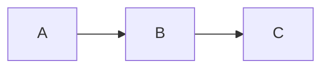

# All three diagrams round-trip

单文档同时含 mermaid / flow / sequence 三种 code block，用于跨库联合 round-trip 校验。



```flow
st=>start: Start
op=>operation: My Operation
e=>end: End

st->op->e
```

```sequence
title: Basic hello
Alice->Bob: Hi Bob
Bob-->Alice: Hello Alice
```

