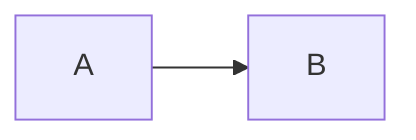

# Fence info meta round-trip

```js {highlight-lines=[1,3]}
const a = 1;
const b = 2;
const c = 3;
```

```ts {title="demo.ts" line-numbers}
export const x: number = 42;
```

```python
def greet(name):
    return f"hello, {name}"
```



```
no language here
```
