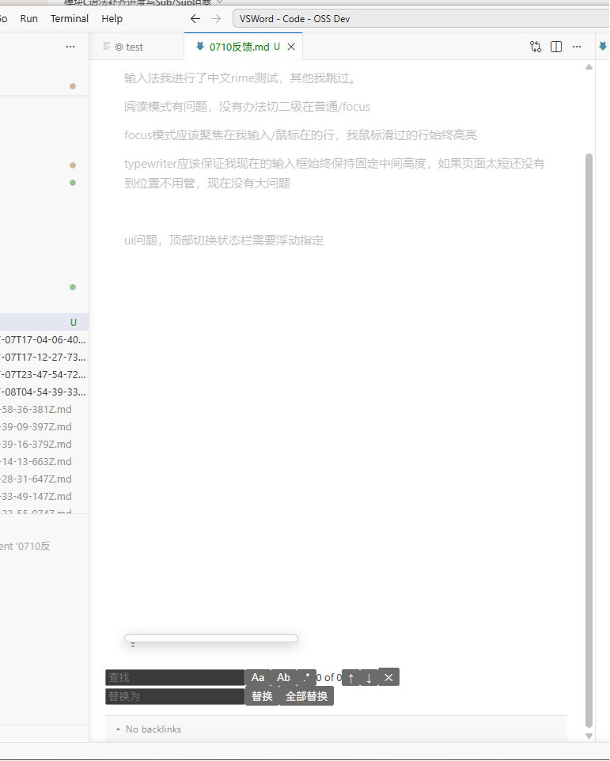

现在我进行输入法测试。还是自动保存会出现打断的情况。会失焦

输入法我进行了中文rime测试，其他我跳过。

阅读模式有问题，没有办法切二级在普通/focus

focus模式应该聚焦在我输入/鼠标在的行，我鼠标滑过的行始终高亮

typewriter应该保证我现在的输入框始终保持固定中间高度，如果页面太短还没有到位置不用管，现在没有大问题

 

ui问题，顶部切换状态栏需要浮动置顶

下侧会始终有这个替换栏存在

