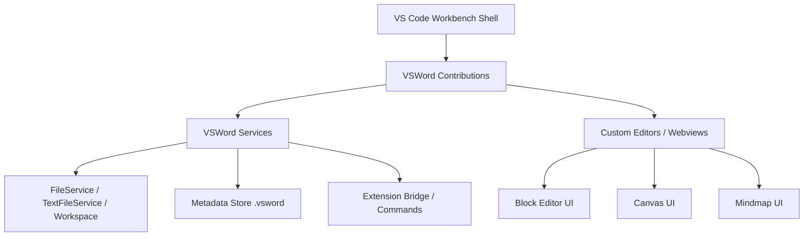
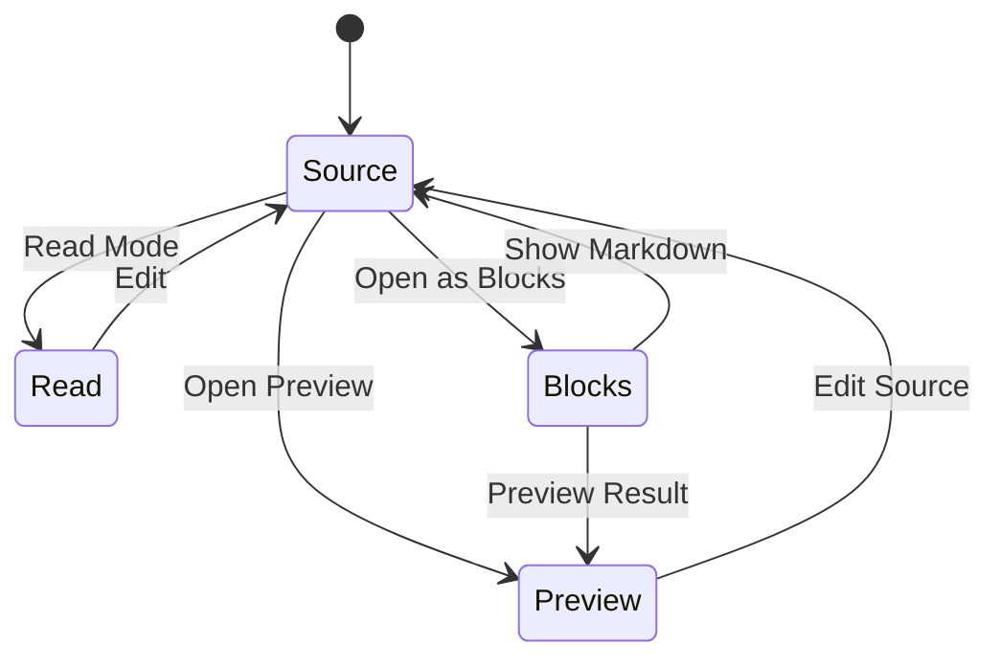
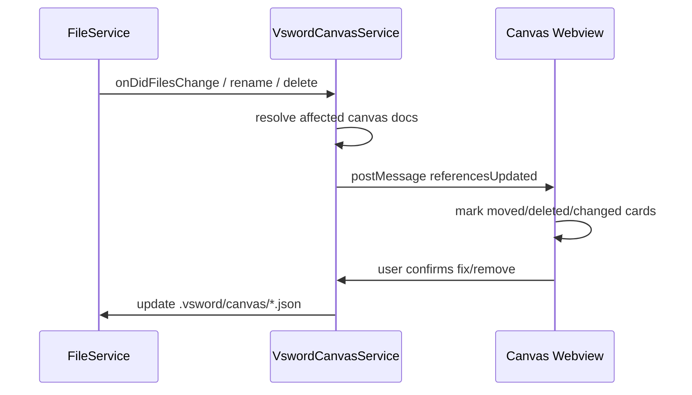
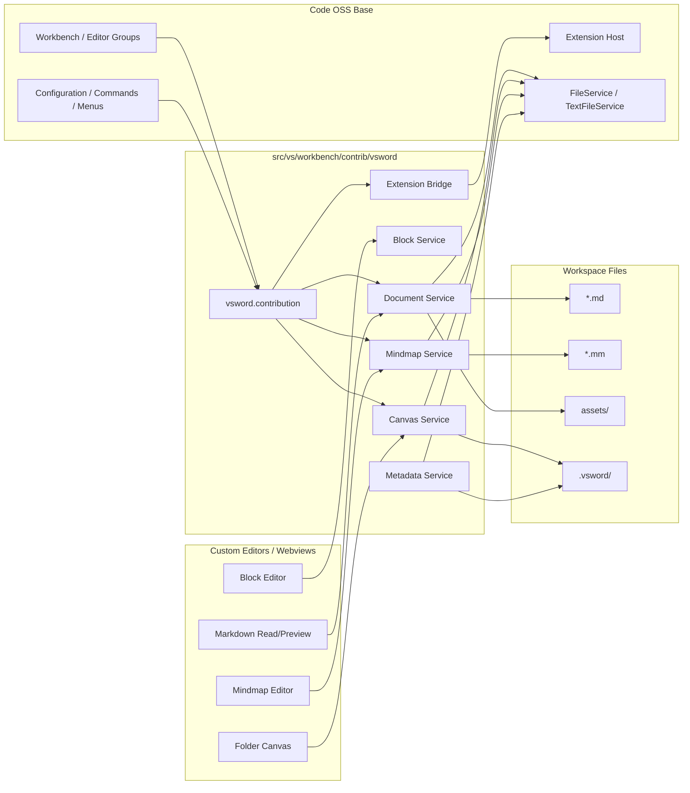

# Phase 0 技术预研：VSWord 功能架构（Markdown / Block Editor / Canvas / .mm Mind Map）

> 项目路径：`/mnt/d/git/VSWord`  
> 预研范围：在 Code OSS / VS Code 开源底座中，模块化实现 VSWord 的文档、文件夹 Canvas、`.mm` 思维导图能力。  
> 约束：保留 VS Code 扩展生态；默认不集成 Copilot；不做实时协作；用户内容保持本地透明文件；尽量少改 Code OSS 核心。  
> 本文只做架构预研，不引入 npm 包，不修改源码。

---

## 0. 结论摘要

### 推荐总体路线

1. **所有 VSWord 产品功能集中放在新的 workbench contrib 模块下**：
   - 首选：`src/vs/workbench/contrib/vsword/`
   - 只在必要位置做少量注册式改动，例如 `workbench.contributions.ts`、`product.json`、默认配置、菜单/命令注册入口。
   - 不直接改 VS Code 原有 Markdown 扩展、Explorer、Editor、Extension Host 的核心逻辑；通过 contribution、service、custom editor、webview、commands、configuration 扩展。

2. **Markdown 保持“源文件为权威数据源”**：
   - 源码模式直接使用 Monaco text editor。
   - 预览/阅读模式复用或包装 VS Code Markdown preview 能力。
   - 块编辑模式作为 Markdown 的结构化视图，必须遵守 round-trip 策略，不能吞未知语法。
   - 对无法安全结构化编辑的片段，降级为 raw markdown block。

3. **Notion 式块编辑器优先采用 ProseMirror / TipTap 路线，但建议先以 webview/custom editor 隔离实现**：
   - TipTap 开发效率最高，生态成熟；ProseMirror 可控性最强；Lexical 性能和交互优秀但 Markdown round-trip 成本更高。
   - MVP 建议：`custom editor + webview` 承载块编辑 UI，主进程/workbench service 负责文件、AST、metadata、命令、备份。
   - 后续如需深度集成 VS Code keybinding/context menu，可逐步迁入 workbench DOM 部件，但初期不建议侵入 core editor。

4. **Canvas 建议作为“文件夹的可视化视图”，元数据存入 `.vsword/canvas/`**：
   - 文件仍是真实文件系统实体，Canvas 只保存布局、节点、边、批注、分组等视图数据。
   - 推荐渲染选型：MVP 用 React Flow 或 tldraw；若要自由白板体验，tldraw 更接近目标；若要文件关系图和节点边稳定编辑，React Flow 更工程化。
   - 不建议 MVP 使用 PixiJS/Konva 作为第一选择，除非已有大量自定义高性能绘制需求。

5. **`.mm` 思维导图以 FreeMind XML 兼容为目标**：
   - 使用 XML parser/writer（如 fast-xml-parser 同类）构建中间模型。
   - 必须保留未知 XML 属性、未知子节点、顺序、注释/富文本等未支持内容，避免数据损失。
   - MVP 支持基础节点文本、折叠、链接、图标、备注、位置/左右侧；布局可先树形布局。
   - 支持 Markdown 大纲互转，但明确标记为有损/半有损转换。

6. **VSWord 专属扩展 API 不应修改现有 VS Code API 形状**：
   - 不向 `vscode` 主命名空间直接加不兼容 API。
   - 推荐提供内置扩展 `vsword` 或 proposed/internal API 桥接，通过 commands、custom editors、file system、webview message、context keys 暴露能力。
   - 稳定后可设计 `vsword.documents`、`vsword.canvas`、`vsword.mindmap`、`vsword.metadata` namespace，但要与 VS Code API 分层。

---

## 1. Code OSS 中的推荐模块位置与边界

### 1.1 推荐目录结构

与总控计划保持一致，建议新增：

```text
src/vs/workbench/contrib/vsword/
├── common/
│   ├── vswordTypes.ts             # 通用类型、URI、ID、错误码
│   ├── documentModel.ts           # Markdown/文档模型
│   ├── blockModel.ts              # 块模型和 Markdown AST 映射
│   ├── canvasModel.ts             # Canvas schema
│   ├── mindmapModel.ts            # Mind map schema
│   ├── metadataModel.ts           # .vsword metadata schema
│   └── extensionApi.ts            # VSWord 扩展 API 类型草案
├── browser/
│   ├── vsword.contribution.ts     # workbench contribution 入口
│   ├── welcome/
│   ├── writingHome/
│   ├── markdown/
│   ├── blockEditor/
│   ├── canvas/
│   ├── mindmap/
│   ├── preview/
│   └── settings/
├── services/
│   ├── vswordDocumentService.ts
│   ├── vswordMarkdownService.ts
│   ├── vswordBlockService.ts
│   ├── vswordCanvasService.ts
│   ├── vswordMindmapService.ts
│   ├── vswordMetadataService.ts
│   ├── vswordIndexService.ts
│   └── vswordExtensionService.ts
└── test/
    ├── browser/
    ├── common/
    └── fixtures/
```

### 1.2 最小侵入注册点

Code OSS 通常通过 contribution registry、editor resolver、custom editor、menus、commands、configuration 注册功能。VSWord 应尽量只触碰以下注册层：

| 注册点 | 用途 | 侵入程度 | 备注 |
|---|---|---:|---|
| Workbench contribution | 注册 VSWord 服务、命令、视图、context key | 低 | 例如 `vsword.contribution.ts` |
| Editor contribution / Editor resolver | 为 `.md`、`.mm`、文件夹 Canvas 提供打开方式 | 中低 | 避免替换默认 text editor，只新增可选/默认 editor |
| Custom editor provider | 块编辑器、mindmap、canvas UI | 低 | 可通过 webview 隔离第三方 UI |
| View container / viewlet | VSWord Home、文档导航、素材库 | 低 | 保留 Explorer 和 Extensions |
| Menu / keybinding contribution | 命令入口、模式切换、`/` menu | 低 | 注意不覆盖用户 keybindings |
| Configuration registry | `vsword.*` 设置项 | 低 | 用于模式默认值、资源路径等 |
| Product/default settings | 默认隐藏 Copilot/开发者噪音 | 中 | 属于产品化层，不在本文展开 |
| Extension Host API | VSWord 专属 API | 中高 | 不建议直接修改 `vscode.d.ts` 作为第一步 |

### 1.3 模块分层建议



分层原则：

- **UI 层**：只负责交互和渲染，不直接写用户文件；通过 service 或 webview message 请求持久化。
- **Service 层**：统一处理 FileService、TextFileService、备份、冲突检测、schema version migration。
- **Model 层**：纯数据结构和转换函数，尽量可单测。
- **Extension Bridge 层**：只提供 VSWord 额外能力，不影响 VS Code 原生 extension API。

### 1.4 不推荐的实现方式

- 不建议直接 fork/重写 VS Code 原生 Markdown 扩展作为主路径；会增加上游同步成本。
- 不建议把所有 VSWord 数据塞入 workspace storage/global storage；用户难以迁移和审计。
- 不建议修改 Monaco text model 的语义来承载块编辑；风险高且影响所有文本编辑器。
- 不建议在 Phase 1-3 直接改 Extension Host 主协议；应先用 commands/custom editor 方式验证。

---

## 2. Markdown 文档能力设计

### 2.1 四种模式

| 模式 | 目标用户场景 | 技术承载 | 写入策略 |
|---|---|---|---|
| 源码模式 Source | 精确编辑 Markdown、处理未知语法 | 原生 Monaco text editor | 直接编辑 `.md` |
| 预览模式 Preview | 类 VS Code Markdown preview，边写边看 | 复用/包装 Markdown preview webview | 不写或只写 preview state |
| 阅读模式 Read | 沉浸式排版、隐藏编辑控件 | Webview / readonly custom editor | 不写正文，只保存阅读设置 |
| 块编辑模式 Blocks | Notion 式块操作、`/` menu、拖拽 | Custom editor + webview 或 workbench component | 通过 Markdown AST round-trip 写回 `.md` |

模式关系：



### 2.2 Markdown 数据模型

建议内部表示分三层：

```text
Raw Markdown Text
  ↓ parse
Markdown AST / Token Stream
  ↓ normalize supported nodes
VSWord Block Model
```

#### Block Model 示例

```ts
interface VswordBlock {
  id: string;
  type: 'paragraph' | 'heading' | 'list' | 'task' | 'quote' | 'code' | 'image' | 'table' | 'callout' | 'raw';
  markdownRange?: { startOffset: number; endOffset: number };
  attrs: Record<string, unknown>;
  children?: VswordBlock[];
  text?: string;
  rawMarkdown?: string;
  preservation?: {
    originalMarkdown?: string;
    unknownSyntax?: boolean;
    unsafeToRewrite?: boolean;
  };
}
```

### 2.3 Frontmatter

推荐支持 YAML frontmatter，MVP 不必内置复杂数据库能力，但要打好基础。

#### 识别规则

- 文件开头 `---\n ... \n---` 解析为 frontmatter。
- 支持基本字段：`title`、`created`、`updated`、`tags`、`aliases`、`status`、`cover`。
- 不认识字段必须保留。
- 解析失败时不阻塞源码编辑；块编辑器中以 raw/frontmatter error 展示。

#### 模型示例

```ts
interface VswordFrontmatter {
  known: {
    title?: string;
    created?: string;
    updated?: string;
    tags?: string[];
    aliases?: string[];
    status?: string;
    cover?: string;
  };
  unknown: Record<string, unknown>;
  raw: string;
  parseError?: string;
}
```

#### 写回策略

- 只修改 VSWord 明确拥有的字段或用户在属性面板中修改的字段。
- 保留字段顺序和注释的能力取决于 YAML parser；如果 parser 不支持注释 round-trip，应把 frontmatter raw token 纳入保留策略。
- 自动更新时间 `updated` 应可配置，默认不要在每次打开文件时写入。

### 2.4 图片和资源管理

#### 推荐默认资源布局

```text
project-root/
├── docs/article.md
├── assets/
│   └── article/
│       ├── image-20260615-001.png
│       └── diagram.svg
└── .vsword/
    └── metadata/
```

也可支持相邻目录：

```text
article.md
article.assets/
└── image.png
```

#### 粘贴图片流程

1. 用户在 Markdown/Block 编辑器粘贴图片。
2. VSWord 询问或按配置决定目标目录：`assets/{docName}/` 或 `{docName}.assets/`。
3. 使用 FileService 写入资源文件。
4. 在 Markdown 中插入相对路径：``。
5. 在 `.vsword/metadata` 中可选记录 asset manifest，但不能成为唯一引用来源。

#### 风险点

- Windows/WSL 路径大小写、特殊字符和空格。
- 多 workspace root 时相对路径归属。
- 文件重命名导致引用失效；需监听 file rename 并提供修复建议。
- 粘贴同名文件冲突；需要稳定命名策略。

### 2.5 Word Count

推荐作为 `VswordDocumentService` 的轻量能力：

- 对 Markdown 源码做 token 化统计，排除 frontmatter、代码块、HTML 可配置。
- 中英文混排统计策略：
  - CJK 字符按字计数。
  - Latin 单词按 word boundary 计数。
  - 数字是否计入可配置。
- 提供状态栏 item、文档属性、命令：`vsword.document.showWordCount`。
- 大文件使用 debounce + incremental cache，不在每次 keypress 全量同步阻塞 UI。

### 2.6 Round-trip 策略

Markdown 块编辑最大风险是数据损失。建议明确等级：

| 等级 | 策略 | 示例 |
|---|---|---|
| Safe | 可结构化编辑并稳定写回 | heading、paragraph、task list、blockquote |
| Preserved | UI 可显示但默认不改内部 | HTML block、复杂 table、未知 directive |
| Raw | 作为原始块展示，只允许源码编辑 | 不认识的插件语法、嵌入脚本 |
| Unsupported | 提醒用户切源码模式 | 解析错误且无法定位 |

#### 关键规则

- 块编辑器只重写用户实际修改过的 block；未触碰 block 尽量保留原文。
- 对未知语法建立 raw block，写回时 byte-for-byte 保留。
- 支持源文件外部变更检测；若 block editor 未保存且磁盘变化，提示 merge/reload。
- 建立 round-trip 测试夹具：输入 Markdown → parse → serialize → diff，未修改时必须零差异或只允许明确格式化范围。

---

## 3. Notion 式块编辑器选型

### 3.1 选型维度

- Markdown round-trip 能力。
- 中文 IME 稳定性。
- Slash menu、拖拽块、嵌套列表、表格、图片、代码块。
- 与 VS Code keybinding/context menu/command palette 的冲突处理。
- 大文档性能。
- 可维护性和生态。
- 在 Code OSS workbench 中的打包和许可证风险。

### 3.2 TipTap / ProseMirror / Lexical 对比

| 方案 | 优点 | 缺点 | 适配 VSWord 结论 |
|---|---|---|---|
| ProseMirror | 底层能力强，schema/transaction 可控，历史久，适合严肃编辑器 | API 底层，开发成本高，插件组合复杂 | 适合作为长期核心，尤其强调 round-trip 和事务控制时 |
| TipTap | 基于 ProseMirror，API 友好，扩展多，Notion-like 功能实现快 | 抽象层可能限制极端定制；版本/商业扩展需审查 | MVP 首选，提高速度；核心保留 ProseMirror transaction 理解 |
| Lexical | Meta 出品，性能好，现代架构，React 生态友好，IME 体验普遍不错 | Markdown 生态和复杂 schema round-trip 不如 ProseMirror 成熟；迁移成本 | 适合纯富文本/知识库编辑，但 VSWord 的 Markdown 兼容目标下不是首选 |

### 3.3 放在 workbench 还是 webview

#### 方案 A：Workbench DOM Component

优点：

- 更容易接入 VS Code keybinding、context key、theme、accessibility、menus。
- 与 editor group、dirty state、undo/redo 的集成可更深。
- 无 webview message 边界，性能和调试链路更直接。

缺点：

- 第三方编辑器依赖进入 workbench bundle，影响 Code OSS 构建、体积和许可证审查。
- 容易与 VS Code 全局 CSS、事件系统、IME 处理产生耦合。
- 后续上游同步冲突概率更高。

#### 方案 B：Custom Editor + Webview

优点：

- 与 VS Code core 隔离好，第三方 UI 依赖放在 webview bundle。
- 自定义编辑器生命周期天然适合 `.md` block mode、`.mm`、Canvas。
- 出问题时不影响 Monaco 和普通源码编辑。
- 更接近 VS Code 扩展开发模型，有利于将来部分能力外置成内置扩展。

缺点：

- 与 VS Code keybindings/menus/theme/clipboard/drag-drop 通信更复杂。
- webview 大文档通信需做增量协议。
- 中文 IME、焦点、快捷键冲突需要专项测试。

#### 推荐

- **Phase 2-4：优先 Custom Editor + Webview**。
- 只把通用服务和命令放在 workbench；编辑器 UI 放在 webview。
- 当 block editor 成熟并确认需要更深体验时，再评估 workbench 原生化。

### 3.4 中文 IME 风险

重点测试：

- 拼音输入过程中按 Enter/Space/Escape 是否被 slash menu 或 keybinding 截获。
- compositionstart/compositionupdate/compositionend 期间不触发 Markdown 自动格式化。
- 列表、标题、代码块边界处中文输入不丢字、不乱序。
- Windows 中文输入法、搜狗、微软拼音、macOS 拼音（未来）、Linux fcitx/ibus。
- Webview 焦点切换时 composition 不应提前提交或丢失。

建议规则：

```text
if (event.isComposing || editorView.composing) {
  不处理 slash menu、markdown shortcut、block transform 快捷键
}
```

### 3.5 快捷键风险

- VS Code 全局 keybinding 会在 webview 和 workbench 间竞争。
- `Ctrl+B/I/K`、`Tab/Shift+Tab`、`Enter`、`Backspace`、`/`、`#`、`-`、`[]` 等是编辑器高频冲突键。
- 推荐设计：
  - 文档内文本编辑快捷键由 block editor 处理。
  - 全局命令通过 webview message 调 `vscode.commands.executeCommand` 桥接。
  - 对高风险快捷键提供 `vsword.blockEditor.handleTab` 等配置。

### 3.6 性能风险

| 场景 | 风险 | 缓解 |
|---|---|---|
| 5MB+ Markdown | AST parse 和 DOM 节点过多 | 分块解析、虚拟化、源码模式优先提示 |
| 大量图片 | Webview 内存膨胀 | lazy load、缩略图缓存、限制解码尺寸 |
| 频繁保存 | serialize 阻塞 | debounce、worker、只序列化变更 block |
| 外部文件变更 | 状态冲突 | text model version + dirty state + reload/merge |
| 超长列表/表格 | 编辑器布局卡顿 | 虚拟列表、表格降级 raw/源码编辑 |

---

## 4. 文件夹 Canvas 模块

### 4.1 产品语义

“文件夹即 Canvas”表示：任意 workspace 文件夹可打开为一个可视化画布，画布中可以放置：

- 文件卡片：真实文件/目录的引用。
- 文本便签：仅存在于 Canvas 元数据中。
- 图片/链接卡片：可引用真实资源或 URL。
- Frame/分组：组织视觉区域。
- Edge/连线：表达关系。
- Pin/Sticker：轻量标注。

文件系统仍是主数据源，Canvas 是视图层和知识组织层。

### 4.2 数据存储位置

推荐：

```text
project-root/
└── .vsword/
    └── canvas/
        ├── index.json
        ├── root.canvas.json
        └── docs__chapter1.canvas.json
```

`index.json` 负责 folder URI 到 canvas file 的映射。

```json
{
  "version": 1,
  "canvases": [
    {
      "folder": "docs/chapter1",
      "canvas": ".vsword/canvas/docs__chapter1.canvas.json",
      "updatedAt": "2026-06-15T00:00:00.000Z"
    }
  ]
}
```

### 4.3 Canvas Schema 草案

```ts
interface VswordCanvasDocument {
  schemaVersion: 1;
  id: string;
  workspaceRoot: string;
  folderUri: string;
  title?: string;
  viewport?: { x: number; y: number; zoom: number };
  nodes: VswordCanvasNode[];
  edges: VswordCanvasEdge[];
  groups?: VswordCanvasGroup[];
  metadata?: Record<string, unknown>;
}

interface VswordCanvasNode {
  id: string;
  type: 'file' | 'folder' | 'note' | 'image' | 'url' | 'frame' | 'sticker';
  position: { x: number; y: number };
  size?: { width: number; height: number };
  zIndex?: number;
  data: {
    uri?: string;              // file/folder/image/url 引用
    title?: string;
    text?: string;
    color?: string;
    icon?: string;
    preview?: boolean;
  };
  createdAt?: string;
  updatedAt?: string;
}

interface VswordCanvasEdge {
  id: string;
  source: string;
  target: string;
  label?: string;
  type?: 'line' | 'arrow' | 'curve';
  data?: Record<string, unknown>;
}
```

### 4.4 渲染选型对比

| 方案 | 优点 | 缺点 | 适配结论 |
|---|---|---|---|
| React Flow | 节点/边模型成熟，适合关系图、文件卡片、布局、选择拖拽；React 生态好 | 自由白板、手绘、无限画布体验不如 tldraw；复杂自定义交互需二次开发 | 若 Canvas 更偏“文件关系图/知识网络”，MVP 首选 |
| tldraw | 白板体验优秀，内置无限画布、选择、缩放、形状、文本，产品感强 | 数据模型偏白板，文件卡片/真实文件同步需要适配；依赖体积和许可证需审查 | 若目标是 Miro/Heptabase 风格，MVP 强候选 |
| Konva | Canvas 2D 封装，性能和自定义绘制能力好 | 需要自己实现大量编辑器能力：选择、连线、文本、框选、历史等 | 不推荐 MVP，适合后期特定高性能画布 |
| PixiJS | WebGL 性能强，适合大量对象渲染 | UI 编辑器基础能力缺失，文本/可访问性/表单复杂 | 不推荐文档 Canvas MVP；适合超大规模视觉化专项 |

#### 推荐路线

- **MVP 推荐二选一**：
  - 文件关系、节点边优先：React Flow。
  - 自由画布、手感优先：tldraw。
- 架构上抽象 `VswordCanvasRendererAdapter`，避免数据模型绑定某个库。
- Canvas 数据模型采用 VSWord 自有 schema，渲染库 schema 只作为 UI 状态或可迁移层。

### 4.5 文件卡片与真实文件同步

#### 同步原则

- 文件卡片节点保存 workspace-relative URI，而不是复制文件内容。
- 文件重命名/移动时尽力更新 Canvas 引用。
- 文件删除时节点保留为 broken reference，并显示修复/移除操作。
- 新建文件卡片时通过 FileService 创建真实文件。
- 拖入已有文件时创建引用节点，不复制文件，除非用户选择复制。

#### 事件流



### 4.6 预览能力

文件卡片应分层支持：

- Markdown：标题、frontmatter、摘要、字数、首图。
- 图片：缩略图。
- PDF：图标/第一页缩略图（后续）。
- 目录：子项数量、最近修改。
- 未知类型：图标、文件大小、修改时间。

预览缓存可以放：

```text
.vsword/cache/previews/
```

但缓存可删除，不作为唯一数据。

---

## 5. `.mm` 思维导图模块

### 5.1 `.mm` 格式背景

`.mm` 通常指 FreeMind XML 格式，基本结构类似：

```xml
<map version="1.0.1">
  <node TEXT="Root">
    <node TEXT="Child" POSITION="right" />
  </node>
</map>
```

不同工具会扩展属性、图标、富文本、链接、云朵、箭头、备注等。因此 VSWord 必须以兼容和保留为优先。

### 5.2 Parser / Writer 选择

可选：

- `fast-xml-parser`：轻量、速度快、可解析属性，适合 MVP。
- `sax` / streaming parser：适合超大 XML，但开发复杂。
- DOMParser 类方案：浏览器端方便，但 Node/workbench 侧一致性需确认。

推荐：MVP 使用 fast-xml-parser 同类库，但实现时要验证：

- 属性前缀和文本节点配置。
- 是否保留节点顺序。
- 是否保留 CDATA、注释、processing instruction。
- 序列化是否会改变空节点、实体转义、属性顺序。

如果无法做到无损写回，必须引入 preservation model。

### 5.3 Mindmap 中间模型

```ts
interface VswordMindmapDocument {
  schemaVersion: 1;
  sourceFormat: 'freemind-mm';
  sourceVersion?: string;
  root: VswordMindmapNode;
  raw?: {
    xmlDeclaration?: string;
    doctype?: string;
    unknownTopLevel?: unknown[];
  };
}

interface VswordMindmapNode {
  id: string;
  text: string;
  children: VswordMindmapNode[];
  side?: 'left' | 'right';
  folded?: boolean;
  link?: string;
  icons?: string[];
  note?: string;
  color?: string;
  backgroundColor?: string;
  style?: Record<string, unknown>;
  raw: {
    tagName: string;
    attributes: Record<string, string>;
    unknownAttributes: Record<string, string>;
    unknownChildren: unknown[];
    originalOrder?: unknown[];
  };
}
```

### 5.4 未知 XML 属性保留策略

必须保留：

- 未识别属性：如 `CREATED`、`MODIFIED`、`HGAP`、`VGAP`、工具自定义属性。
- 未识别子节点：如 `<font>`、`<hook>`、`<cloud>`、`<arrowlink>`、`<richcontent>`。
- 子节点顺序：尤其 richcontent、font、icon 与 node 的相对顺序。
- XML 实体和换行：尽量保持；若格式化不可避免，需要测试兼容性。

#### 写回规则

- 用户只改节点文本时，仅更新对应 node 的 `TEXT` 或 richcontent text，其他属性原样保留。
- 用户新增节点时，生成最小 FreeMind 兼容 XML。
- 用户删除节点时，删除其完整 XML 子树。
- 不支持编辑的复杂节点，在 UI 中显示“部分内容受保护”。

### 5.5 基础布局

MVP 可选布局：

1. 根节点居中。
2. 一级节点按 `POSITION=left/right` 分左右；缺失时自动平衡。
3. 子节点按树深度水平展开。
4. 每个节点根据文本宽度估算尺寸。
5. 用 tidy tree / Reingold-Tilford 类算法或简化层级布局。
6. 折叠节点只显示汇总标记。

可先不把布局写回 `.mm`，除非格式中存在明确位置字段；VSWord 自有 UI 状态可存入：

```text
.vsword/metadata/mindmap/<hash>.json
```

### 5.6 Markdown 大纲互转

#### Markdown → Mindmap

规则：

- H1 作为 root；如果多个 H1，创建虚拟 root。
- H2-H6 根据 heading 层级形成树。
- heading 下的段落可作为 note。
- list 可作为子节点。
- links/images 可转为 node link 或 note。

示例：

```md
# Book
## Chapter 1
- Scene A
- Scene B
## Chapter 2
```

转为：

```text
Book
├── Chapter 1
│   ├── Scene A
│   └── Scene B
└── Chapter 2
```

#### Mindmap → Markdown

规则：

- root → H1。
- 深度 1-5 → H2-H6。
- 超过 H6 → list 缩进。
- note → heading 下正文或 blockquote。
- icon/color/folded 等视觉信息可放入 HTML 注释或 frontmatter 扩展，但默认不污染正文。

#### 转换性质

- Markdown 大纲互转是“结构转换”，不是 `.mm` 的完整无损转换。
- 必须提示用户 `.mm` 特有样式、图标、位置可能无法在 Markdown 表达。

---

## 6. VSWord 专属扩展 API 初步设计

### 6.1 设计原则

1. **不破坏 VS Code extension API**：原生扩展继续 `import * as vscode from 'vscode'`，行为不变。
2. **VSWord API 与 VS Code API 分离**：避免直接修改稳定 `vscode.d.ts`，除非进入长期维护阶段。
3. **能力可降级**：普通 VS Code 中安装 VSWord 扩展时，可以检测 API 不存在并降级。
4. **优先 commands/events/custom editors 组合**：先以约定命令和 JSON schema 暴露。
5. **稳定后再提供 typed API**：例如 `@vsword/api` 类型包或内置 `vsword` 模块。

### 6.2 命名空间草案

```ts
declare namespace vsword {
  export namespace documents {}
  export namespace canvas {}
  export namespace mindmap {}
  export namespace metadata {}
}
```

### 6.3 `vsword.documents`

能力：

- 获取 Markdown frontmatter。
- 获取文档字数统计。
- 在源码/预览/阅读/块模式之间切换。
- 监听文档 metadata 变化。

草案：

```ts
namespace vsword.documents {
  interface MarkdownStats {
    words: number;
    characters: number;
    cjkCharacters: number;
    readingTimeMinutes?: number;
  }

  function getFrontmatter(uri: vscode.Uri): Thenable<Record<string, unknown>>;
  function updateFrontmatter(uri: vscode.Uri, patch: Record<string, unknown>): Thenable<void>;
  function getWordCount(uri: vscode.Uri): Thenable<MarkdownStats>;
  function open(uri: vscode.Uri, mode?: 'source' | 'preview' | 'read' | 'blocks'): Thenable<void>;
}
```

### 6.4 `vsword.canvas`

能力：

- 打开文件夹 Canvas。
- 添加/移除文件卡片。
- 读取/更新 Canvas 布局。
- 监听 Canvas 节点变化。

```ts
namespace vsword.canvas {
  interface CanvasNode { id: string; type: string; uri?: vscode.Uri; }
  interface CanvasDocument { folder: vscode.Uri; nodes: CanvasNode[]; }

  function open(folder: vscode.Uri): Thenable<void>;
  function get(folder: vscode.Uri): Thenable<CanvasDocument | undefined>;
  function addFile(folder: vscode.Uri, file: vscode.Uri, position?: { x: number; y: number }): Thenable<string>;
  function revealNode(folder: vscode.Uri, nodeId: string): Thenable<void>;
}
```

### 6.5 `vsword.mindmap`

能力：

- 打开 `.mm`。
- 读取中间模型。
- 与 Markdown 大纲互转。

```ts
namespace vsword.mindmap {
  interface MindmapNode {
    id: string;
    text: string;
    children: MindmapNode[];
  }

  function open(uri: vscode.Uri): Thenable<void>;
  function parse(uri: vscode.Uri): Thenable<MindmapNode>;
  function exportMarkdown(uri: vscode.Uri, target?: vscode.Uri): Thenable<vscode.Uri>;
  function importMarkdown(markdownUri: vscode.Uri, targetMmUri: vscode.Uri): Thenable<void>;
}
```

### 6.6 `vsword.metadata`

能力：

- 读取/写入 `.vsword/metadata` 中的透明 JSON metadata。
- 提供 schema version 和 migration。
- 避免扩展随意写内部文件导致损坏。

```ts
namespace vsword.metadata {
  function get<T = unknown>(uri: vscode.Uri, key: string): Thenable<T | undefined>;
  function update<T = unknown>(uri: vscode.Uri, key: string, value: T): Thenable<void>;
  function deleteKey(uri: vscode.Uri, key: string): Thenable<void>;
}
```

### 6.7 API 暴露路径建议

阶段化：

| 阶段 | 暴露方式 | 说明 |
|---|---|---|
| Phase 1-2 | Commands + configuration | 如 `vsword.documents.openBlocks` |
| Phase 3 | Internal service + built-in extension bridge | 供 VSWord 内置功能使用 |
| Phase 4-5 | Proposed typed API | 提供 `@vsword/api` 类型，仍走 command bridge |
| 稳定后 | 正式 VSWord Extension API | 版本化、文档化、兼容性测试 |

---

## 7. Phase 1-5 可执行任务拆解与验收标准

> Phase 0 的 Code OSS 基线、构建、Marketplace、Copilot 默认禁用不在本文展开；本文从功能架构角度拆 Phase 1-5。

### Phase 1 — Writer Workbench Shell

目标：把 Code OSS 默认体验调整为写作工作台，但保留扩展生态和开发功能入口。

#### 任务

1. 新建 `src/vs/workbench/contrib/vsword/` contribution 骨架。
2. 注册 VSWord Home / Writing Home 视图或欢迎页。
3. 注册 `vsword.*` configuration namespace。
4. 注册基础命令：
   - `vsword.openWritingHome`
   - `vsword.newMarkdownDocument`
   - `vsword.openFolderCanvas`
   - `vsword.openMindmap`
5. 调整默认布局：隐藏但不删除 Debug/Terminal/SCM 等开发者入口。
6. 保留 Extensions 入口、VSIX 安装能力、命令面板。
7. 建立扩展兼容 smoke test 清单。

#### 验收标准

- 启动后默认进入 writer-friendly 首页。
- Extensions 仍可打开，已安装扩展可启用/禁用。
- 命令面板中可找到 VSWord 命令。
- 默认无 Copilot 推荐/入口（若产品层已处理）。
- 不影响打开普通文件夹和普通文本文件。

### Phase 2 — Markdown Core

目标：提供可靠 Markdown 写作基础。

#### 任务

1. 实现 Markdown 文档 service 设计：读取、frontmatter parse、word count。
2. 实现源码/预览/阅读三模式切换。
3. 设计 image paste asset flow。
4. 设计并实现 Markdown preview/read webview 的主题适配。
5. 增加状态栏字数统计。
6. 增加 frontmatter 属性面板 MVP。
7. 建立 Markdown round-trip 测试 fixtures。

#### 验收标准

- `.md` 可用源码模式正常编辑保存。
- frontmatter 未知字段不丢失。
- 粘贴图片后资源写入可追踪目录，Markdown 使用相对路径。
- 字数统计对中英文混排有稳定结果。
- 阅读模式不修改正文文件。
- 常见 Markdown 扩展仍可工作或有明确兼容边界。

### Phase 3 — Block Editor MVP

目标：实现 Notion-like Markdown 块编辑。

#### 任务

1. 确定 TipTap/ProseMirror 或 Lexical 方案并完成许可证审查。
2. 实现 custom editor + webview block editor。
3. 实现 block model 与 Markdown AST 映射。
4. 支持基础 block：paragraph、heading、bullet/ordered list、task、quote、code、image。
5. 实现 `/` menu：标题、列表、任务、引用、代码、图片。
6. 实现拖拽排序、块级插入/删除。
7. 实现 raw block 保留策略。
8. 建立中文 IME 和快捷键专项测试。

#### 验收标准

- 未修改文档经过 block editor 打开/关闭后无非预期 diff。
- 修改单个简单 block 时，其他未知语法保持原样。
- 中文输入法组合输入不丢字、不误触发 `/` menu。
- 大纲/列表/任务可正确写回 Markdown。
- 外部修改文件时能提示 reload/merge。
- block editor 出错可回退源码模式。

### Phase 4 — Folder Canvas MVP

目标：每个文件夹可以打开为 Canvas，进行文件组织和视觉关联。

#### 任务

1. 定义 `.vsword/canvas` schema 和 migration 机制。
2. 实现 `VswordCanvasService`：open/save/load/index。
3. 选择 React Flow 或 tldraw 并实现 webview renderer。
4. 支持文件/目录卡片：拖入、打开、重命名、删除状态提示。
5. 支持 note、frame、edge、sticker MVP。
6. 实现文件变更监听和 broken reference UI。
7. 实现 Canvas viewport/layout 持久化。
8. 实现基础缩略预览和缓存策略。

#### 验收标准

- 对任意 workspace folder 执行 `Open as Canvas` 可创建/打开 Canvas。
- `.vsword/canvas/*.json` 可读、可版本化、可手工审计。
- 文件卡片双击能打开真实文件。
- 文件移动/删除后 Canvas 给出正确提示，不崩溃。
- 画布布局保存重启后恢复。
- 删除 `.vsword/cache` 不影响核心数据。

### Phase 5 — `.mm` Mind Map MVP

目标：读写 FreeMind 风格 `.mm`，并支持与 Markdown 大纲互转。

#### 任务

1. 确认 XML parser/writer 方案和保留能力。
2. 实现 `.mm` parse → `VswordMindmapDocument`。
3. 实现 `VswordMindmapDocument` → `.mm` serialize。
4. 实现 mindmap custom editor webview。
5. 实现基础树形布局、节点编辑、新增、删除、折叠。
6. 保留未知 XML 属性和未知子节点。
7. 实现 Markdown outline import/export。
8. 建立 FreeMind/XMind/其他工具样例兼容测试。

#### 验收标准

- 常见 `.mm` 文件可打开并显示树结构。
- 未修改 `.mm` 保存后不丢未知属性/子节点。
- 修改节点文本后可被 FreeMind 类工具继续打开。
- 新建 mindmap 可保存为基本兼容 `.mm`。
- Markdown 大纲导入/导出结构正确，并提示可能有损。

---

## 8. 风险清单

### 8.1 架构和上游同步风险

| 风险 | 影响 | 概率 | 缓解 |
|---|---:|---:|---|
| 修改 Code OSS core 过多导致难以上游同步 | 高 | 中 | 所有功能集中在 `contrib/vsword`，核心只做注册 |
| 产品默认 UI 调整破坏扩展入口 | 高 | 中 | 扩展 smoke test 作为每阶段 gate |
| VSWord API 修改 `vscode` 稳定 API | 高 | 低/中 | 先 command bridge，后 typed API |
| 第三方编辑器库打包与许可证问题 | 中高 | 中 | Phase 3 前做许可证和 bundle size 审查 |

### 8.2 数据安全风险

| 风险 | 影响 | 概率 | 缓解 |
|---|---:|---:|---|
| Markdown block editor 写回导致数据损失 | 高 | 高 | raw block、只改 touched block、round-trip fixtures |
| `.mm` XML 序列化丢未知属性 | 高 | 中高 | preservation model，兼容样例测试 |
| Canvas 引用文件移动后失效 | 中 | 高 | FileService 事件监听，broken reference 修复 |
| 图片粘贴路径错误或覆盖 | 中 | 中 | 统一 asset naming，冲突检测，相对路径测试 |
| frontmatter 注释/顺序丢失 | 中 | 中 | raw preservation；无法保留时只改明确字段 |

### 8.3 编辑体验风险

| 风险 | 影响 | 概率 | 缓解 |
|---|---:|---:|---|
| 中文 IME 与快捷键冲突 | 高 | 高 | composition guard，专项测试矩阵 |
| Webview 焦点导致全局快捷键不可用 | 中 | 中 | command bridge，配置化快捷键处理 |
| 大文档 block editor 卡顿 | 高 | 中 | 大文件阈值、虚拟化、源码模式回退 |
| Canvas 大量节点性能下降 | 中 | 中 | 节点虚拟化/LOD，限制预览并 lazy load |
| Mindmap 大树布局拥挤 | 中 | 中 | 折叠、搜索、分支聚焦 |

### 8.4 生态兼容风险

| 风险 | 影响 | 概率 | 缓解 |
|---|---:|---:|---|
| VS Code Markdown 扩展与 VSWord Markdown 功能冲突 | 中 | 中 | 不覆盖默认 editor，使用 explicit open mode |
| 自定义 editor 影响用户默认打开方式 | 中 | 中 | 提供 setting：默认源码/块/阅读 |
| Open VSX 扩展依赖 Microsoft 服务 | 中 | 中 | marketplace 兼容清单，失败时提示 |
| 主题在 webview 中不一致 | 低/中 | 高 | 使用 VS Code CSS variables，主题回归测试 |

---

## 9. 测试策略

### 9.1 单元测试

重点覆盖 pure model/service：

- Markdown frontmatter parse/serialize。
- Word count 中英文混排。
- Markdown AST → block model → Markdown。
- Canvas schema migration。
- Canvas file reference resolve。
- `.mm` XML parse/serialize preservation。
- Markdown outline ↔ mindmap conversion。

### 9.2 Round-trip Fixtures

建议建立：

```text
src/vs/workbench/contrib/vsword/test/fixtures/
├── markdown/
│   ├── simple.md
│   ├── frontmatter-with-comments.md
│   ├── mixed-cjk-en.md
│   ├── tables.md
│   ├── html-block.md
│   ├── unknown-directives.md
│   └── huge.md
├── mindmap/
│   ├── freemind-basic.mm
│   ├── freemind-icons.mm
│   ├── richcontent.mm
│   ├── unknown-attrs.mm
│   └── large.mm
└── canvas/
    ├── basic.canvas.json
    ├── missing-file.canvas.json
    └── migrated-v0.canvas.json
```

Round-trip Gate：

```text
input -> parse -> serialize -> output
未修改场景：output 应等于 input，或仅允许白名单格式化差异。
修改场景：diff 应限制在用户修改节点/块附近。
```

### 9.3 集成测试

- 打开 workspace。
- 创建 Markdown，切换源码/预览/阅读/块模式。
- 粘贴图片，保存，重启，路径仍有效。
- 打开文件夹 Canvas，拖入文件，保存，重启。
- 重命名/删除真实文件，Canvas 状态正确。
- 打开 `.mm`，编辑节点，保存，再打开。
- Markdown 大纲导入为 `.mm`，再导出 Markdown。

### 9.4 Extension Compatibility Smoke Test

每个阶段至少验证：

- 主题扩展：安装、启用、切换主题。
- Markdown 扩展：语法高亮/preview enhancement 不崩溃。
- 拼写检查扩展：在源码模式可工作。
- 文件图标扩展：Explorer 正常。
- 本地 VSIX 安装：可安装/卸载。
- 命令面板、设置 UI、keybindings UI 正常。

### 9.5 手工体验测试矩阵

| 类别 | 测试项 |
|---|---|
| 中文输入 | 微软拼音、搜狗；标题、列表、代码块、slash menu |
| Markdown | frontmatter、表格、HTML、脚注、任务列表、图片相对路径 |
| Canvas | 100/1000 节点、缩放、拖拽、框选、保存恢复 |
| Mindmap | 100/1000 节点、折叠、左右布局、未知属性保留 |
| 文件系统 | Windows 路径、空格、中文文件名、大小写、移动/重命名 |
| 主题 | Light/Dark/High Contrast，webview CSS variables |

---

## 10. 推荐的近期决策点

1. **Block editor UI 承载方式**：建议确认 Phase 3 使用 custom editor + webview，而非直接嵌入 workbench DOM。
2. **Block editor 内核**：建议优先 TipTap/ProseMirror；在正式引入前做许可证、bundle size、IME spike。
3. **Canvas 渲染库**：产品偏关系图选 React Flow，偏自由白板选 tldraw；数据模型保持自有 schema。
4. **`.mm` 兼容等级**：明确 MVP 是 FreeMind 基础兼容，不承诺 XMind 完整兼容。
5. **VSWord API 暴露节奏**：先 commands/internal service，后 typed namespace，不直接破坏 VS Code API。
6. **数据无损 Gate**：Markdown 和 `.mm` 的 round-trip fixture 必须作为 Phase 3/5 进入实现前的硬门槛。

---

## 11. 建议最终架构图



---

## 12. 最终建议

VSWord 应把自身定位为 Code OSS 的“写作与知识工作台发行版”，而不是重写 VS Code。技术上最稳妥的路线是：

- **核心保持 VS Code 兼容**：Extension Host、FileService、Text Editor、Commands、Settings 不破坏。
- **VSWord 功能插件化/贡献化**：集中在 `src/vs/workbench/contrib/vsword/`。
- **复杂编辑 UI webview 隔离**：block editor、canvas、mindmap 都先通过 custom editor + webview 做 MVP。
- **所有用户数据透明本地化**：正文在 `.md`/`.mm`/资源文件；布局和索引在 `.vsword/`。
- **数据无损优先于炫酷编辑**：Markdown 和 `.mm` 的 round-trip 能力是后续实现的核心质量门槛。
